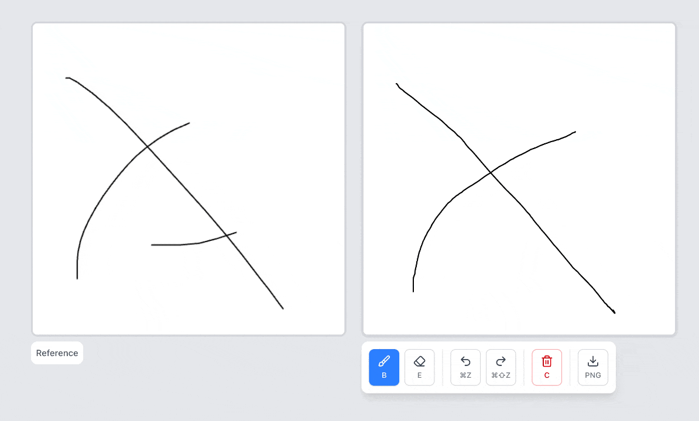
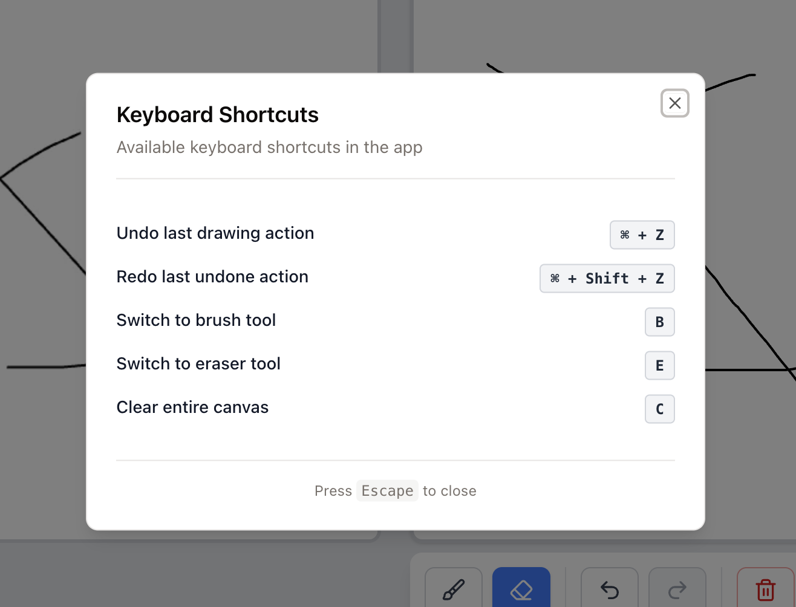
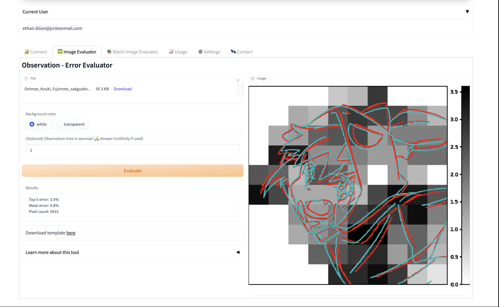

# VisArt_X

Draw and evaluate your art.

Fastest way to improve observation skills for artists.

Observation is needed to use characters sheets or use production document effectively

## Demo




## Features
- Canvas: Drawing interface
- Reference image
- Tool and shortcut

Comming soon:
- Evaluation of accuracy using the reference image
- Reference auto generation
- Puzzle Reference (learn how to draw 3d object in perspective)

## Old Version



[Youtube video: how it used to work](https://youtu.be/NQQWYc9yUDo?si=Br9K8jBcflSECvaO&t=45)

This repo is under major refactor from the previous gradio app.
The gradio app was lacking interactive drawing and evaluation which made it painfuly slow to use. (going back and forth between photoshop and the gradio app with layer exports)

The backend is going to be fully rewritten with a new architecture.

## Tech stack
- Konva.js
- Next.js
- Tailwind
- Shadcn
- React
- TypeScript

## Install

```bash
npm install
```

## Run

```bash
npm run dev
```